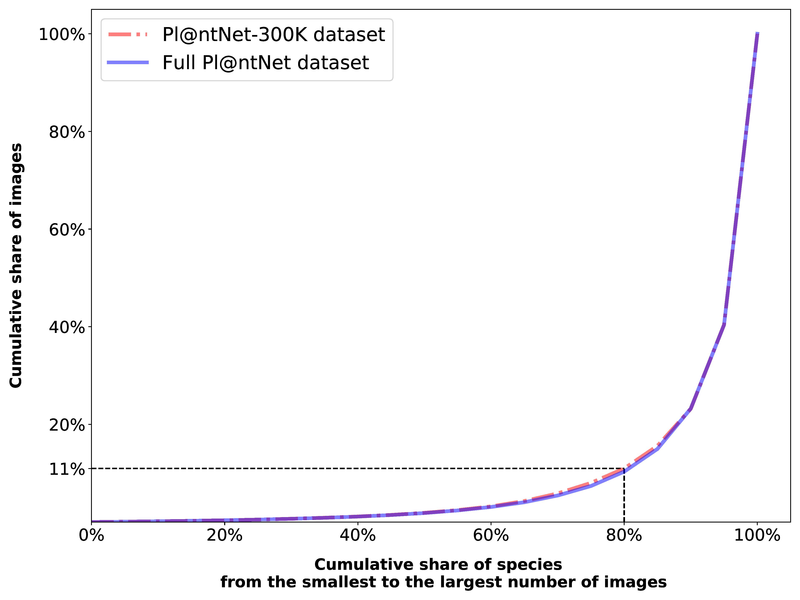

# PlantNet-300K

<p align="middle">
  
  
  
  
</p>

This repository contains the code used to produce the benchmark in the paper ***"Pl@ntNet-300K: a plant image dataset with high label
ambiguity and a long-tailed distribution"***.

## Download the dataset

In order to train a model on the PlantNet-300K dataset, you first have to [download the dataset on Zenodo](https://zenodo.org/record/5645731#.Yuehg3ZBxPY).

## Scientific Publication

You can find detailed information about the dataset as well as extensive experiments in the [NeurIPS 2021 paper](https://datasets-benchmarks-proceedings.neurips.cc/paper/2021/file/7e7757b1e12abcb736ab9a754ffb617a-Paper-round2.pdf).
If you use this work for your research, please cite the paper:

    @inproceedings{plantnet-300k,
    author    = {Garcin, Camille and Joly, Alexis and Bonnet, Pierre and Lombardo, Jean-Christophe and Affouard, Antoine and Chouet, Mathias and Servajean, Maximilien and Lorieul, Titouan and Salmon, Joseph},
    booktitle = {NeurIPS Datasets and Benchmarks 2021},
    title     = {{Pl@ntNet-300K}: a plant image dataset with high label ambiguity and a long-tailed distribution},
    year      = {2021},
    }
    
## Overview

Pl@ntNet-300K is a plant dataset containing 306,146 plant images covering 1081 species (the classes).
Pl@ntNet-300K is characterized by high class ambiguity and strong class imbalance.
The graph below highlights the long-tailed distribution of the dataset: 80% of species account for only 11% of the total number of images.

<p align="center">

</p>

The images are split into a train, val and test set, each containing the following number of images : 

<div align="center">

| Train | Val | Test | Total
|-----------------|-----------------|-----------------|-----------------|
| 243,916         | 31,118          | 31,112          | 306,146 |

</div>

### Dataset Version & Meta-data files

Make sure you download the latest version of the dataset in Zenodo (version 1.1 as in the link above, not 1.0).
The difference lies in the metadata files, the images are the same.
If you wish to download **ONLY** the metadata files (not possible in Zenodo), you will find them [here](https://lab.plantnet.org/seafile/d/bed81bc15e8944969cf6/).
The folder contains three files: 

- `plantnet300K_metadata.json`  maps the id of each image with several pieces of information (species id, split, author, license, ...) 
- `plantnet300K_species_id_2_name.json`, maps the species id and its scientific name
- `class_idx_to_species_id.json`, maps the class id (from 0 to 1080) to the species id (useful for the pretrained weights)

### Hyperparameters

If you are looking for the hyperparameters used in the paper, you can find them in the [supplementary material](https://datasets-benchmarks-proceedings.neurips.cc/paper/2021/hash/7e7757b1e12abcb736ab9a754ffb617a-Abstract-round2.html).


### Pre-trained models

You can find the pre-trained models [here](https://lab.plantnet.org/seafile/d/01ab6658dad6447c95ae/).
To load the pre-trained models, you can simply use the `load_model` function in `utils.py`. For instance, if you want to load the resnet18 weights:

```python
from utils import load_model
from torchvision.models import resnet18

filename = 'resnet18_weights_best_acc.tar' # pre-trained model path
use_gpu = True  # load weights on the gpu
model = resnet18(num_classes=1081) # 1081 classes in Pl@ntNet-300K

load_model(model, filename=filename, use_gpu=use_gpu)
```

Note that if you want to fine-tune the model on another dataset, you have to change the last layer. You can find examples in the `get_model` function in `utils.py. 
### Requirements

Only pytorch, torchvision are necessary for the code to run. 
If you have installed anaconda, you can run the following command:

```conda env create -f plantnet_300k_env.yml```

### Training a model

In order to train a model on the PlantNet-300K dataset, run the following command:

```python main.py --lr=0.01 --batch_size=32 --mu=0.0001 --n_epochs=30 --epoch_decay 20 25 --k 1 3 5 10 --model=resnet18 --pretrained --seed=4 --image_size=256 --crop_size=224 --root=path_to_data --save_name_xp=xp1```

 You must provide in the `root` option the path to the train val and test folders (here: `path_to_data`). 
 The `save_name_xp` option is the name of the directory where the weights of the model and the results (metrics) will be stored.
 You can check out the different options in the file `cli.py`.

